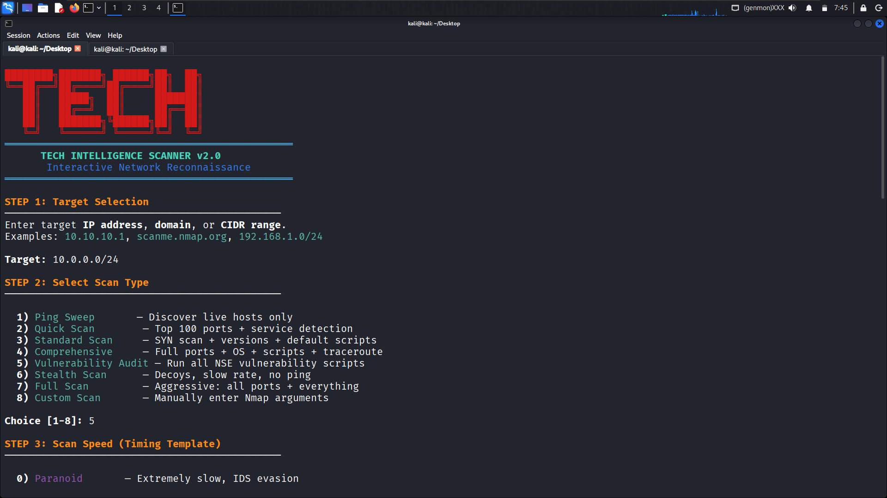

████████╗███████╗ ██████╗██╗  ██╗
╚══██╔══╝██╔════╝██╔════╝██║  ██║
   ██║   █████╗  ██║     ███████║
   ██║   ██╔══╝  ██║     ██╔══██║
   ██║   ███████╗╚██████╗██║  ██║
   ╚═╝   ╚══════╝ ╚═════╝╚═╝  ╚═╝

      TECH INTELLIGENCE SCANNER v2.0
       Interactive Network Reconnaissance


# Tech Intelligence Scanner

Tech Intelligence Scanner is a Bash-based cybersecurity framework that automates network reconnaissance and security assessment tasks using Nmap.

## Features

* Host Discovery
* Port Scanning
* Service Detection
* Operating System Detection
* NSE Script Scanning
* Vulnerability Auditing
* Network Mapping
* Mix Scan Mode
* Ultimate Scan Mode
* TXT Reports
* XML Reports
* HTML Reports
* Interactive Hacker-Style Interface

## Requirements

* Nmap
* Bash
* xsltproc (for HTML reports)

## Installation

```bash
git clone https://github.com/techintelligence100-wq/Tech-Intelligence.git
cd Tech-Intelligence
chmod +x Techintellgence.bash
./Techintellgence.bash
```

## Disclaimer

This tool is intended for authorized security testing, educational purposes, and lab environments only. Users are responsible for complying with applicable laws and obtaining permission before scanning systems or networks.


<p align="center">
  
</p>

<h3 align="center">Tech Intelligence Scanner</h3>